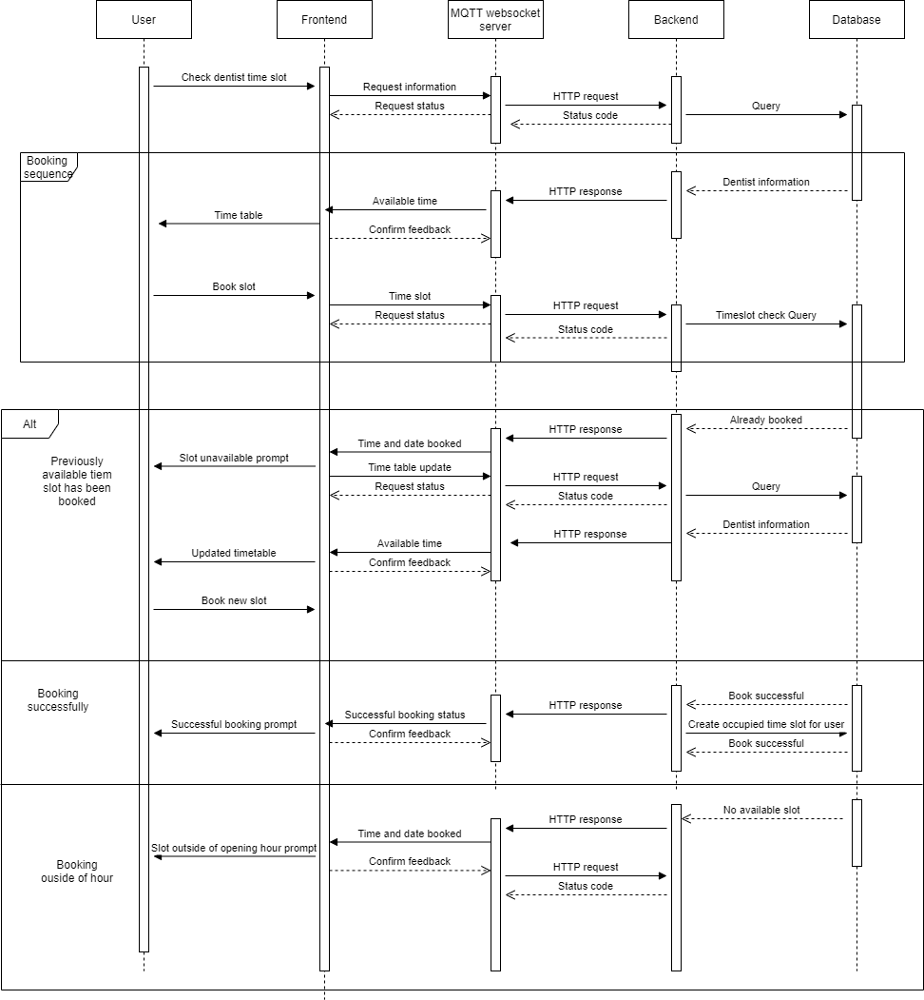
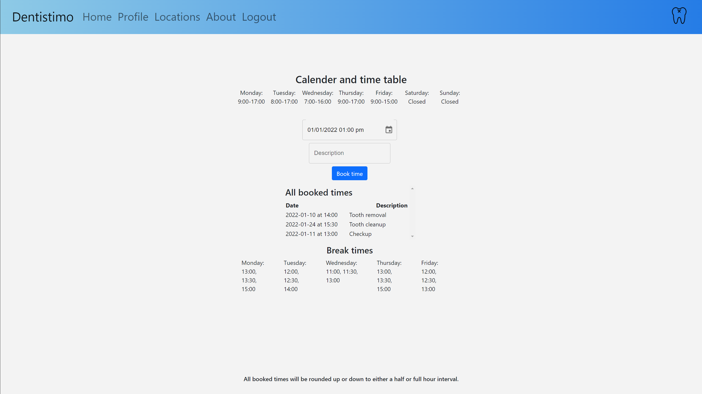

# Documentation

## Table of Contents

- [Purpose](#purpose) 
    - [What?](#what)
    - [Why?](#why)
    - [How?](#how)
    - [Team Members](#team-members)
    - [Team Resources](#team-resources)
- [Software Requirement Specification (SRS)](#software-requirement-specification-srs)
- [Software Architecture Document (SAD)](#software-architecture-document-sad)
- [Program Management Report (PMR)](#program-management-report-pmr)

## Purpose

### What?
The purpose of this system is to allow the citizens of Gothenburg to book their dentist appointments through a graphical user interface. For optimal user experience, dentist clinics are displayed on a map that can be navigated. 

### Why?
Current situation shows that booking a dentist appointment in the city of Gothenburg is not as easy as one would think. People usually spend hours searching for different dentists without the guarantee of finding a suitable available timeslot. Serious demand and the lack of a convenient system lead to the need of a smooth and user-friendly system that would enable the end-user to get what they want with just a few clicks. 

### How?
A map showing all available dentists in the area will be used. The user then will only need to choose a dentist and subsequently pick a suitable timeslot for themselves. The system as a whole will be responsible for handling the requests and responding with the most up-to-date data.

### Team Members
- [Anis Bourbia](https://git.chalmers.se/bourbia)
- [Cuong Darma Le Manh](https://git.chalmers.se/darma)
- [Erdem Halil](https://git.chalmers.se/erdemh)
- [George-Vlad Liteanu](https://git.chalmers.se/liteanu)
- [Taofik Arnouk](https://git.chalmers.se/arnouk)

### Team Resources

- [Trello Board](https://trello.com/b/W8kZA5nU/dit355)
- [User Interface](https://git.chalmers.se/courses/dit355/test-teams-formation/team-2/client)
- [Server](https://git.chalmers.se/courses/dit355/test-teams-formation/team-2/server)
- [Client-Map](https://git.chalmers.se/courses/dit355/test-teams-formation/team-2/client-map)
- [Interpreter](https://git.chalmers.se/courses/dit355/test-teams-formation/team-2/interpreter)
- [Web Socket Server](https://git.chalmers.se/courses/dit355/test-teams-formation/team-2/ws-server)

## Software Requirement Specification (SRS)
[Click here to see SRS](./srs/specification.md)

## Software Architecture Document (SAD)

#### Architecture Styles
- Client-server:
Used between the client (front-end) and the remaining components of the distributed system.
- Publish/Subscribe:
For communication between the User Interface and the Interpreter component which will transform the data that comes through MQTT into HTTP requests and vice versa.
- Event-driven with event broker
We also chose the event-driven architecture style with an event broker because It is best suited for using with MQTT whilst having multiple components. The Interpreter and MQTT server will act as our system’s coordinator, sorting out requests from different front-end components and sending them to the corresponding backend components and middleware.

#### Architectural Drivers
- Scalability:
Making use of the distributed architecture allows the system to be highly scalable. If one wants to increase the throughput of the system, adding new resources will be not only enough but also easy.
- Maintainability:
Having decoupling distributed components means that modularity is in place. What is more, independent "nodes" allow easier maintenance and modifiability.
- Interoperability: 
The ability for different systems to communicate with one another is known as interoperability. Data is shared and exchanged between systems using communication. When utilizing the MQTT broker, this is visible.

#### Quality of Service

We have decided to make use of QoS 1 for sending and receiving all MQTT messages within our distributed system.   
QoS 1 means that every message will be sent at least one time and guarantees that the receiver will be delivered. The sender stores the message data until the receiver sends a confirmation message confirming the delivery of the message. If the confirmation is not received within a predefined period of time, the message will be sent again. The process is repeated until a confirmation is received.

QoS 0 is simply not enough because it works on "fire and forget" principle which means that delivery is not guaranteed. On the other hand, implementing QoS 2 creates an unnecessary overhead for our system as the sender strives to deliver the message exactly once which increases message delivery speed significantly. As speed is of importance and sending/receiving the same message multiple times does not affect our system, we think that using QoS 1 for the whole system makes perfect sense for our case.

#### Components
The system consists of 5 components:
- [User Interface](https://git.chalmers.se/courses/dit355/test-teams-formation/team-2/client)
- [Interpreter](https://git.chalmers.se/courses/dit355/test-teams-formation/team-2/interpreter)
- [Server](https://git.chalmers.se/courses/dit355/test-teams-formation/team-2/server)
- [Client-Map](https://git.chalmers.se/courses/dit355/test-teams-formation/team-2/client-map)
- [Web Socket Server](https://git.chalmers.se/courses/dit355/test-teams-formation/team-2/ws-server)

**Component Diagram**

**Entity-Relationship (ER) Diagram**

**Use Case Diagram**

**Booking Sequence Diagram**

**Login Sequence Diagram**

**UI**

## Program Management Report (PMR)
During the entirety of the project, the team will follow agile software development and Scrum principles. The deadline for project completion is 2022/01/05. Given the short lifecylce of the project, the Scrum Master will be the same team member unless extreme and unexpected situations occur. - A typical Sprint will run for 2 weeks starting with Sprint Planning meeting with all of the team members. 
- As per project requirements, a weekly TA meeting (checkpoint) will also take place in order to present progress and receive timely feedback. 
- Depending on Sprint intensity, the Scrum Master will organize several meetings for the team to ensure that everyone is on track. 
- All team members will be in constant communication in case of unexpected impediments and help will be provided whenever necessary. 
- Apart from Git commits, a kanban-style Trello board will be used to ensure traceability is in place. 
- A Sprint will end with a Sprint Review and Retrospective meeting among the team members to discuss improvement possibilities.
